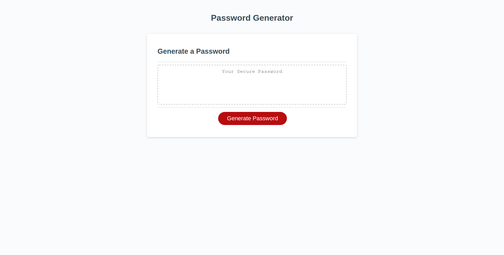
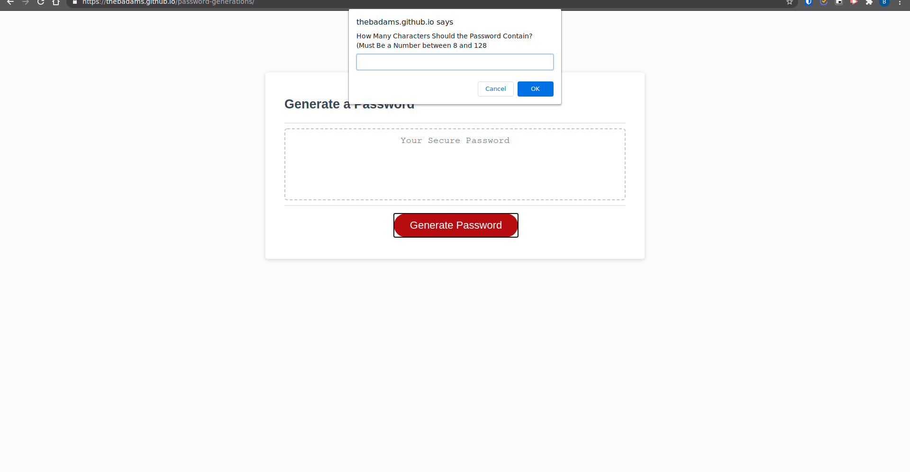
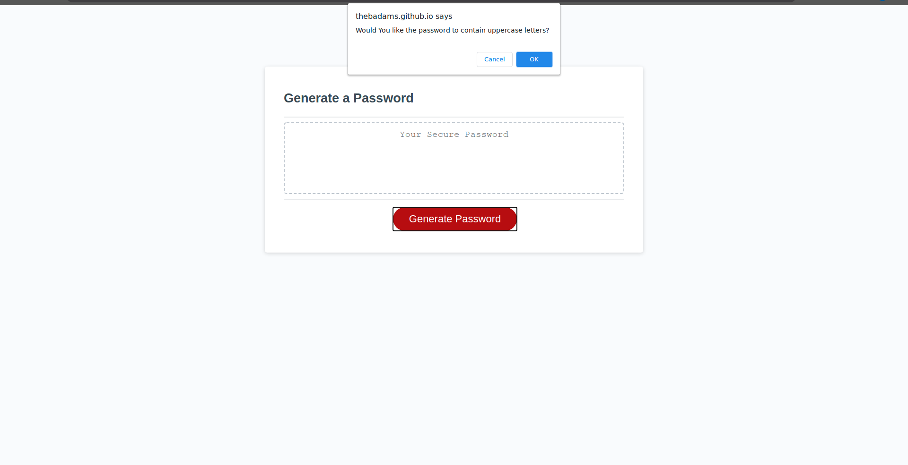
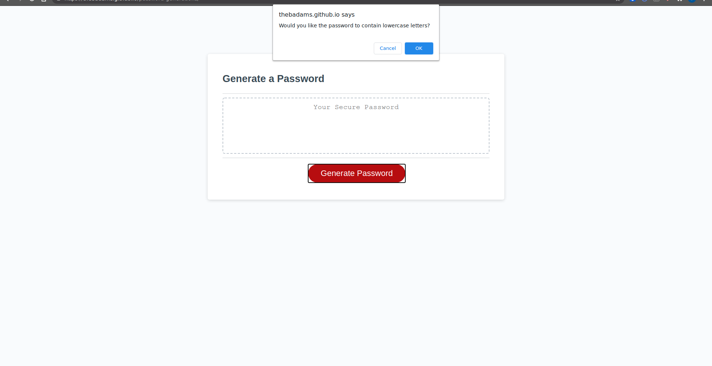
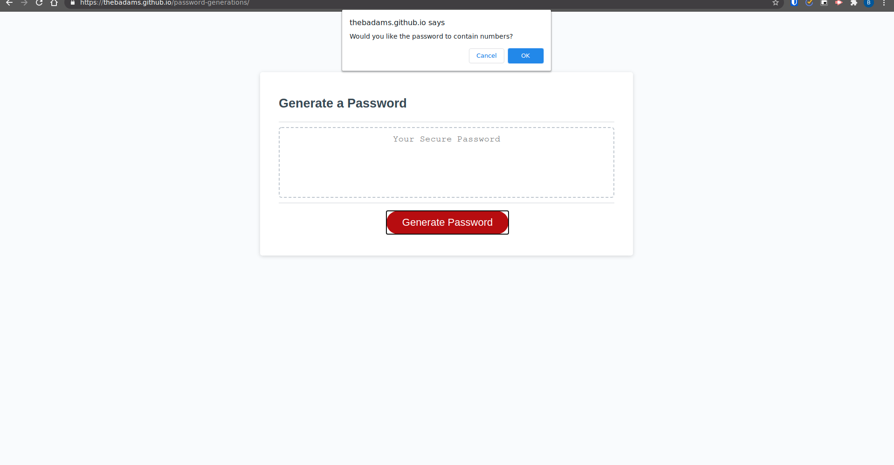
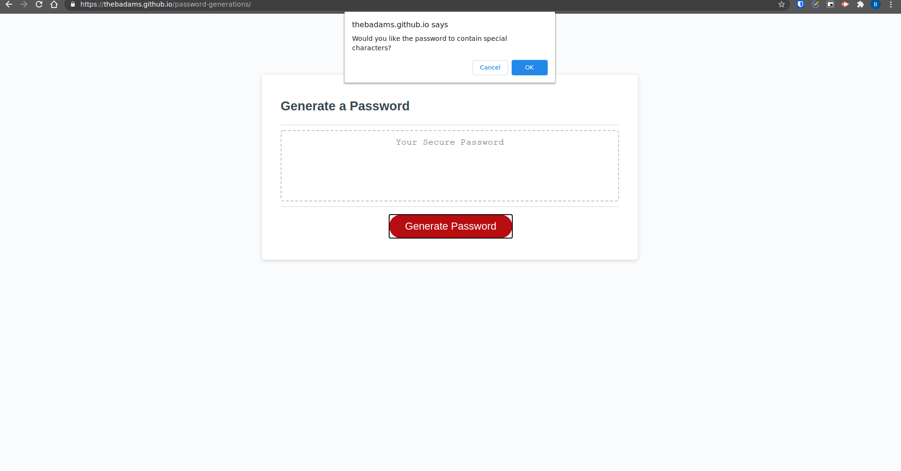
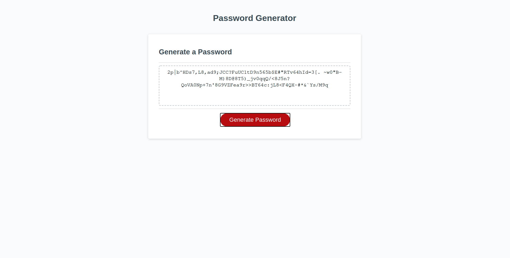

# Password Generator

## Description
This is a web application that generates a password based upon user specifications, and within certain given parameters.

## Instructions
### How to Use

1. Press the "Generate" Button to initialize the password generation process.
1. The User is greeted with several prompts and confirm messages that gather the parameters of the password.
    
    1. A prompt asking for a length of password: should be between 8 and 128 characters.
    1. A confirm asking if User would like to include Uppercase Characters.
    1. A confirm asking if User would like to include Lowercase Characters.
    1. A confirm asking if User would like to include Numeric Characters.
    1. A confirm asking if User would like to include Special Characters.
1. Based upon previous input the password will be constructed then displayed within the textbox.
1. To run the application again and get a different password, click the "Generate" button again.

### Expected Behavior

The web application is expected to behave in the following ways

1. If the User inputs a number that is less than 8, the User is notified that they must input a number between 8 and 128 and are greeted with the prompt again.
1. If the User input a number that is greater than 128, the User is notfified that they must input a number between 8 and 128 and are greeted with the prompt again.
1. If the User inputs something that is not a number, the user is notified that they must input a number between 8 and 128 and are greeted with the prompt again.
1. If the user fails to choose one of the four character sets, the application will alert them that they must choose at least one character set, and send them through the confirms again.

## Screenshots

### Start

### Password Length Query

### Password Uppercase Query

### Password Lowercase Query

### Password Numbers Query

### Password Special Query

### Password End Result

## Links

Deployed Application can be found [here](https://thebadams.github.io/password-generations)

Github Repository can be found [here](https://www.github.com/thebadams/password-generations.git)

## Contact Information

My Github Profile: [thebadams](https://www.github.com/thebadams)

My LinkedIn Profile: [Brian P. Adams](https://www.linkedin.com/in/brian-adams-5a410b53/)

My email address: [bpeteradams@gmail.com](mailto:bpeteradams@gmail.com)

## License

